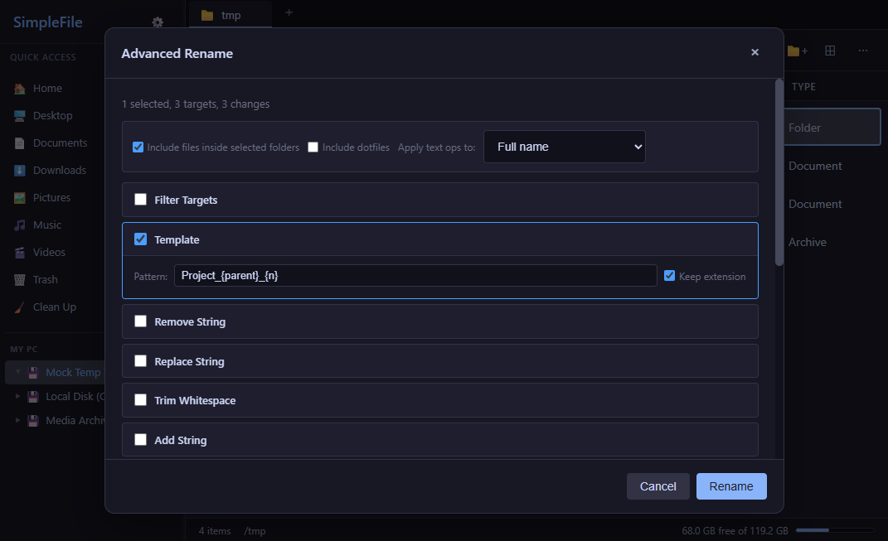
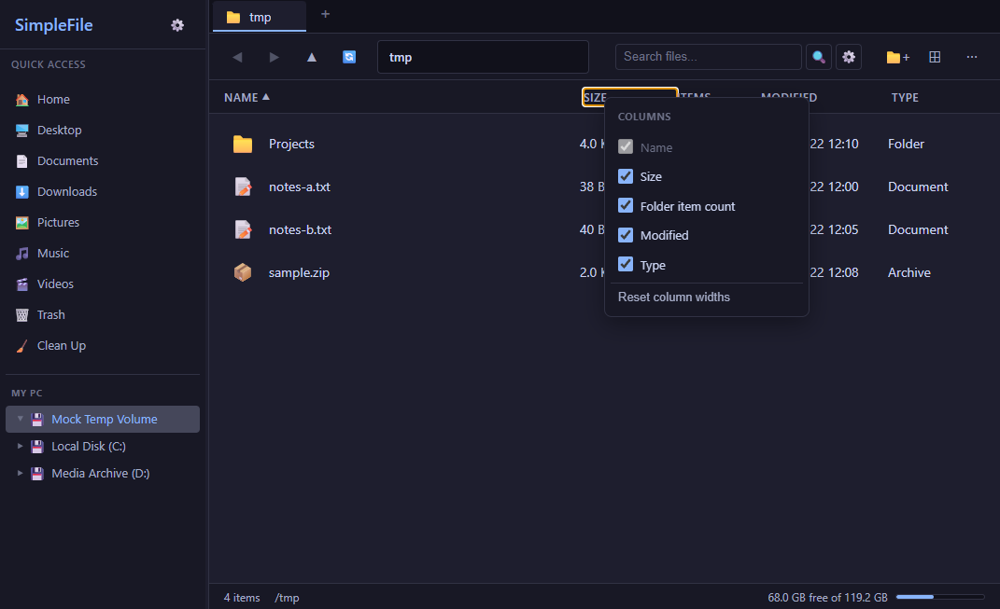
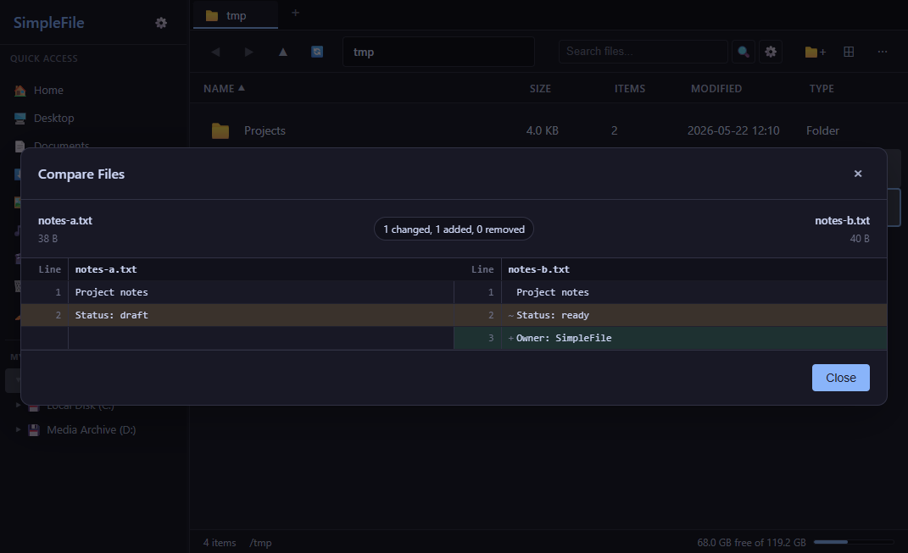

# SimpleFile

<div align="center">

**A Linux file manager built with a Rust/Tauri 2 backend and a Svelte 5 frontend.**

[](https://github.com/conniecombs/SimpleFile-Linux/actions/workflows/ci.yml)
[](https://github.com/conniecombs/SimpleFile-Linux/actions/workflows/release.yml)
[](https://github.com/conniecombs/SimpleFile-Linux/releases)
[](LICENSE)
[](https://tauri.app)
[](https://svelte.dev)
[](#linux-support)
[](docs/SECURITY.md)

</div>

---

## Overview

SimpleFile is a Linux desktop file manager for local files, archives, mounted
volumes, and power-user file operations. The app uses Tauri 2 for the desktop
runtime and Rust command layer, with a Svelte/Vite frontend for the interface.

This repository is Linux-only. The release workflow builds Linux x64 artifacts,
and the Tauri bundle targets are Debian package, RPM package, and AppImage. A
Flatpak manifest is also included for local Flatpak builds.

This README focuses only on the current Linux file-manager scope.

---

## Screenshots

| Advanced rename | Configurable columns | File compare |
|---|---|---|
|  |  |  |

---

## Linux Support

SimpleFile targets modern Linux desktop environments with GTK/WebKitGTK support.

Current release artifacts:

| Artifact | Purpose |
|---|---|
| `.deb` | Debian, Ubuntu, Linux Mint, Pop!_OS, and related distributions |
| `.rpm` | Fedora, openSUSE, RHEL-compatible distributions, and related distributions |
| `.AppImage` | Portable Linux bundle |
| `com.simplefile.SimpleFile.yml` | Flatpak manifest for local Flatpak builds |

Linux integration currently includes:

- `inode/directory` file association metadata.
- A Settings action for `xdg-mime` default file-manager registration.
- Single-instance startup routing for folder/file arguments.
- XDG user-directory discovery for Home, Desktop, Documents, Downloads, Music,
  Pictures, and Videos.
- Mounted-volume listing for `/`, `/home`, `/mnt`, `/media`, and
  `/run/media/$USER`.
- UDisks2 D-Bus monitoring for drive changes.
- Wayland/X11 compatible Tauri windowing through the Linux WebKitGTK stack.

---

## Features

### Navigation

- Tabs for working in multiple folders.
- Dual-pane mode for side-by-side copy and move workflows.
- Folder tree sidebar.
- Breadcrumb navigation and editable path input.
- Quick Access entries based on Linux/XDG user directories.
- Recent locations and bookmarks.
- List and grid views.
- Sortable, configurable, resizable list columns.
- Hidden-file toggle.
- Disk-space status for the current location.

### File Operations

- Create folders and files.
- Rename selected items.
- Advanced Rename with recursive targeting, filters, templates, regex
  replacement, whitespace cleanup, case transforms, sequential numbering, and
  preview validation.
- Copy, cut, paste, and move files or folders.
- Conflict handling for copy and move operations: keep both, replace, skip,
  cancel, and apply-to-remaining.
- Move to trash with permanent-delete fallback when trash is unavailable.
- Pack selected items into a folder and unpack folder contents.
- Open with the default app.
- Open With dialog for selecting an executable.
- Open terminal in the current directory.
- Drag and drop into the app, between panes, and across file-list/tree targets.

### Productivity

- Undo and redo for supported file operations.
- Inline Undo actions in success toasts.
- Clipboard history for recent copy/cut selections.
- Color labels stored locally.
- Command palette.
- Keyboard-first workflows for common operations.

### Search and Inspection

- Quick filtering inside the current folder.
- Recursive search with filename matching, optional content search, hidden-file
  inclusion, extension filters, size filters, date filters, max depth, and max
  result limits.
- Cancellable backend searches with streamed result events.
- Quick Look previews for supported text, image, PDF, and archive-entry content.
- Properties dialog with path, size, modified time, type, permissions, symlink
  targets, and file hashes.
- Image dimensions and EXIF metadata.
- MD5, SHA-1, and SHA-256 checksums.
- Side-by-side UTF-8 text comparison.
- Git repository status and per-file status badges when enabled.
- Disk cleanup scans for large files and duplicate groups.

### Archives

- Browse archive contents.
- Extract archives.
- Create archives from selected files and folders.
- Supported formats include ZIP, TAR, TAR.GZ/TGZ, and RAR where required
  tooling is available.
- Extraction uses path-traversal safeguards.

### Settings

- Dark and light themes.
- Startup location options.
- Persisted tabs.
- Configurable view preferences.
- Delete confirmation setting.
- Git integration toggle.
- Update controls backed by the signed GitHub updater channel.
- About dialog with app metadata and project links.

---

## Install

Download the latest Linux artifact from
[GitHub Releases](https://github.com/conniecombs/SimpleFile-Linux/releases).

Debian or Ubuntu:

```bash
sudo apt install ./simplefile_*_amd64.deb
```

Fedora or compatible RPM distributions:

```bash
sudo dnf install ./simplefile-*.x86_64.rpm
```

AppImage:

```bash
chmod +x ./simplefile_*.AppImage
./simplefile_*.AppImage
```

Flatpak local build:

```bash
flatpak-builder --force-clean build-dir com.simplefile.SimpleFile.yml
```

---

## Development Setup

### System Dependencies

On Debian/Ubuntu:

```bash
sudo apt update
sudo apt install -y \
  build-essential \
  curl \
  pkg-config \
  libwebkit2gtk-4.1-dev \
  libgtk-3-dev \
  libayatana-appindicator3-dev \
  librsvg2-dev \
  libsoup-3.0-dev \
  libjavascriptcoregtk-4.1-dev \
  patchelf \
  rpm
```

Use equivalent WebKitGTK, GTK, Ayatana AppIndicator, librsvg, libsoup, Rust, and
RPM tooling packages on other Linux distributions.

### Rust

Install stable Rust:

```bash
curl --proto '=https' --tlsv1.2 -sSf https://sh.rustup.rs | sh
rustup default stable
```

### Node

The frontend requires Node 24 or newer.

```bash
node --version
npm --version
```

Install frontend dependencies:

```bash
npm ci --prefix frontend
```

### Run the App

```bash
npm run dev
```

The root `dev` script runs the Tauri CLI from the frontend npm toolchain.

---

## Quality Checks

Fast application checks:

```bash
npm run check
```

Rust checks:

```bash
npm run check:rust
```

Full release gate:

```bash
npm run check:release
```

What the checks cover:

- Svelte type checking and Vite production build.
- JavaScript syntax checks for repository scripts.
- Frontend/backend Tauri invoke consistency.
- Updater configuration checks.
- GitHub workflow wiring checks.
- Rust formatting, tests, and Clippy when running `check:rust` or
  `check:release`.
- Rust dependency audit when running `check:release`.

---

## Build

Local Linux installer build without updater artifacts:

```bash
npm run build:tauri:local
```

Signed updater-enabled build:

```bash
export TAURI_SIGNING_PRIVATE_KEY="$(cat .secrets/simplefile-updater.key)"
npm --prefix frontend exec -- tauri build --ci
```

Build output is written under:

```text
src-tauri/target/release/bundle/
```

---

## Updater and Releases

SimpleFile uses the Tauri updater plugin with GitHub Releases as the static
update endpoint:

```text
https://github.com/conniecombs/SimpleFile-Linux/releases/latest/download/latest.json
```

Release behavior:

- Manual release versions are optional. If blank, the workflow uses the version
  in `src-tauri/tauri.conf.json`.
- Explicit manual versions may be `1.1.0` or `v1.1.0`.
- The requested version must match both `src-tauri/Cargo.toml` and
  `src-tauri/tauri.conf.json`.
- Draft releases can build installer-only artifacts without updater signing
  secrets.
- Published updater releases require `TAURI_SIGNING_PRIVATE_KEY`.

Required GitHub secret for published updater releases:

| Secret | Purpose |
|---|---|
| `TAURI_SIGNING_PRIVATE_KEY` | Signs updater artifacts |
| `TAURI_SIGNING_PRIVATE_KEY_PASSWORD` | Optional passphrase, only if the key was generated with one |

The updater private key must never be committed. See
[`docs/UPDATER_RELEASE.md`](docs/UPDATER_RELEASE.md) for key generation,
GitHub secret setup, and release verification.

---

## Project Structure

```text
SimpleFile-Linux/
|-- frontend/
|   |-- index.html
|   |-- package.json
|   |-- src/
|       |-- main.ts
|       |-- App.svelte
|       |-- app.css
|       |-- css/
|       |-- lib/
|           |-- api.ts
|           |-- types.ts
|           |-- app/
|           |-- components/
|           |-- localCommand*.ts
|           |-- transfer*.ts
|-- src-tauri/
|   |-- Cargo.toml
|   |-- Cargo.lock
|   |-- tauri.conf.json
|   |-- tauri.local.conf.json
|   |-- src/
|       |-- lib.rs
|       |-- fs_ops.rs
|       |-- archive.rs
|       |-- search.rs
|       |-- preview.rs
|       |-- progress.rs
|       |-- cleanup.rs
|       |-- git.rs
|       |-- terminal.rs
|       |-- updater.rs
|-- scripts/
|-- docs/
|-- .github/workflows/
|-- com.simplefile.SimpleFile.yml
|-- LICENSE
```

---

## Keyboard Shortcuts

| Shortcut | Action |
|---|---|
| `Enter` | Open selected item |
| `Space` | Quick Look |
| `Backspace` | Go up one folder |
| `Ctrl+A` | Select all |
| `Ctrl+C` | Copy |
| `Ctrl+X` | Cut |
| `Ctrl+V` | Paste |
| `Ctrl+Shift+V` | Clipboard history |
| `Ctrl+Z` | Undo |
| `Ctrl+Y` or `Ctrl+Shift+Z` | Redo |
| `Ctrl+F` | Focus search |
| `Ctrl+N` | Create folder |
| `Ctrl+Shift+N` | Create file |
| `Ctrl+Shift+P` | Open command palette |
| `F2` | Rename |
| `F4` | Open terminal here |
| `F5` | Refresh |
| `Delete` | Delete selected items |
| `Escape` | Close overlays or clear transient UI |

---

## Documentation

- [`docs/CHANGELOG.md`](docs/CHANGELOG.md) - release history.
- [`docs/UPDATER_RELEASE.md`](docs/UPDATER_RELEASE.md) - signed updater setup.
- [`.github/RELEASE.md`](.github/RELEASE.md) - release workflow notes.
- [`docs/CONTRIBUTING.md`](docs/CONTRIBUTING.md) - contribution guide.
- [`docs/SECURITY.md`](docs/SECURITY.md) - vulnerability reporting.
- [`docs/SUPPORT.md`](docs/SUPPORT.md) - support channels.

Some older files under `docs/` may still describe removed or historical
experiments. Treat this README as the authoritative Linux-focused project
overview.

---

## License

SimpleFile is licensed under the Apache License, Version 2.0. See
[`LICENSE`](LICENSE).
